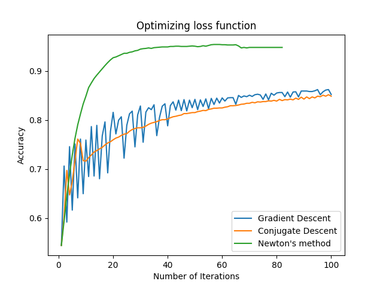

# PythonGradientDescent

## In Optimization.py provided implementation of:

- Gradient Descent with Backtracking line search
- Conjugate Descent
- Newtons Method

Also, I included code that plots the differnce between those methods (plotter.py).

